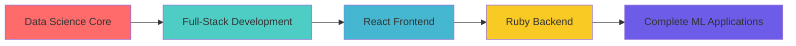

# Neel Chudasama | Data Scientist 🚀

<div align="center">
  
</div>

<div align="center">
  
[](https://github.com/Neel-Chudasama)
[](https://www.linkedin.com/in/neel-chudasama)

</div>

---

## About Me

```python
class DataScientist:
    def __init__(self):
        self.name = "Neel Chudasama"
        self.location = "London 🇬🇧"
        self.role = "Data Scientist"
        self.passions = "Data, Football, Cricket"
    
    def current_focus(self):
        return {
            "🏠": "Automated Real Estate Notification System",
            "📚": "Learning React & Ruby for Full-Stack ML Applications",
            "🔍": "Exploring Advanced ML Algorithms & Deep Learning",
            "💼": "Open to exciting Data Science opportunities"
        }
```

---

## Tech Arsenal

<div align="center">

### 💻 Programming Languages


### 🔬 Data Science & ML


### 🗄️ Big Data & Databases


### 📊 Visualization & Analytics


</div>

---

## 🎯 Featured Projects

<div align="center">

### 🏠 Smart Real Estate Notifier
**Automated Property Alert System**

```yaml
Description: Intelligent system that monitors property listings and automatically sends personalized emails to landlords
Tech Stack: Python | Web Scraping | Email Automation | Data Processing
Status: 🔄 Active Development
Impact: Streamlines property hunting with 90% time reduction
```

### 📈 Data Science Portfolio
**End-to-End ML Solutions**

```yaml
Description: Collection of machine learning projects showcasing various algorithms and techniques
Tech Stack: Python | Scikit-learn | TensorFlow | Pandas | Matplotlib
Highlights: Predictive Analytics | Classification | Regression | Time Series
```

</div>

---

## 📊 GitHub Analytics

<div align="center">
  
  
</div>

<div align="center">
  
</div>

---

## 🎓 What I Bring to the Table

<div align="center">

| 🔍 **Data Analysis** | 🤖 **Machine Learning** | 📊 **Visualization** | 🔧 **Automation** |
|:---:|:---:|:---:|:---:|
| Advanced statistical analysis | Supervised & Unsupervised ML | Interactive dashboards | Process automation |
| Data cleaning & preprocessing | Deep learning models | Data storytelling | ETL pipelines |
| Hypothesis testing | Model optimization | Business intelligence | Workflow optimization |

</div>

---

## 🌟 Current Learning Journey



---

## 🤝 Let's Connect & Collaborate!

<div align="center">

**🔍 Actively seeking opportunities in Data Science & Machine Learning**

[](https://www.linkedin.com/in/neel-chudasama)
[](https://github.com/Neel-Chudasama)
[](mailto:your.email@example.com)

---


**💡 "In Data We Trust, In Insights We Deliver"**

</div>

---

<div align="center">
  
</div>
